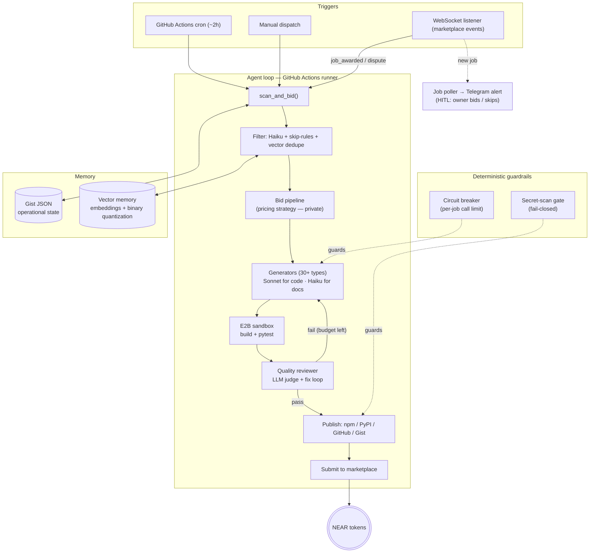

# budget-skynet

**An autonomous AI agent that bids on and completes coding jobs on the [NEAR AI marketplace](https://market.near.ai), earning NEAR tokens — end to end, with no human in the loop for the routine path.**

> **What this is.** A curated engineering case study of a production autonomous agent I built and
> operated. It documents the architecture, the design decisions, and the guardrails — with
> **sanitized, representative code**. The production repository and the live bidding strategy stay
> private; this repo is about *how the system is designed and why*.
>
> **Status (July 2026).** Built and operated **v1** on the NEAR AI marketplace. The marketplace is
> mid-transition to a new [hire-by-job model launching July 2026](#roadmap); I'm **re-architecting
> for that upgrade**. So this is a "here's what I shipped and how I think," not a "come watch it
> earn right now" — the market is quiet by design during the transition.

---

## The problem → the solution

**Problem.** The NEAR AI marketplace posts small, well-specified engineering jobs (npm/PyPI
packages, MCP servers, GitHub Actions, CLI tools, data-analysis notebooks, smart-contract
helpers, …) that pay out in NEAR tokens. Doing them by hand doesn't scale: the value is in
*throughput and consistency*, not in any single deliverable.

**Solution.** An agent that runs the entire loop autonomously and safely:

1. **Discovers** open jobs on a schedule and via a live event stream.
2. **Filters** aggressively (cheap model + rules + semantic dedupe) so expensive work only runs on
   jobs worth bidding.
3. **Bids** with a job-specific proposal.
4. **Generates** the deliverable using the right model for the task type (30+ generators).
5. **Verifies** it in an isolated sandbox — build + tests — and **reviews it with an LLM judge**
   before anything leaves the machine.
6. **Publishes** to the correct registry (npm / PyPI / GitHub / Gist) and **submits** to the
   marketplace.

The interesting part isn't any one step — it's making an unreliable component (an LLM) run a
money-touching loop *without* burning tokens, shipping broken work, or leaking secrets. That's
what the design decisions below are about.

---

## Architecture

### Component breakdown

| Component | Role | Why it's built this way |
|---|---|---|
| **Orchestrator** (`main.py`) | Runs the full cycle: scan → bid → generate → verify → publish → submit; writes a run report + memory stats. | Single deterministic driver; every step leaves an artifact (log / commit / memory entry). |
| **Filter layer** | Level-0 tag rules → Haiku classification → semantic dedupe against past jobs. | Expensive models never touch a job that's obviously out of scope or a near-duplicate of one already handled. |
| **Generators (30+)** | One module per deliverable type, each with an "expert skill" context file and its own eval. | Task-type specialization beats a single mega-prompt; per-type evals catch regressions objectively. |
| **E2B sandbox** | Builds and tests every deliverable in isolation before it can be published. | The agent never executes generated code in its own environment. Isolation is a hard boundary. |
| **Quality reviewer** (`quality/review.py`) | Generate → test → LLM judge (PASS/FAIL) → fix loop, with fast-fail. | Nothing ships on the agent's own confidence — a separate check gates every submission. |
| **Circuit breaker** (`core/claude.py`) | Per-job cap on Claude calls; resets before each job. | A runaway loop can't silently drain the API budget. Cost is bounded by construction. |
| **Memory** | Gist JSON (operational state) + vector store (semantic recall of past jobs). | Survives restarts (stateless GitHub Actions runners); binary-quantized vectors keep it cheap. |
| **Control plane** | Telegram bots: run reports + a control panel with bid/skip/submit buttons. | Human-in-the-loop where it matters, without blocking the autonomous path. |

Full write-up: **[docs/architecture.md](docs/architecture.md)**.

---

## Design decisions (and why)

These are the choices I'd want a reviewer to look at. Each maps to a domain of the
[GitHub Agentic AI Developer (GH-600)](https://docs.github.com) discipline I build agents against.

1. **Don't trust the agent — bound it with deterministic mechanisms.**
   The circuit breaker (per-job call limit) and an ENV-level daily cost ceiling live *outside* the
   agent's reasoning — a bad prompt or a loop can't disable them. Guardrails the agent can't argue
   its way past. *(Domain 6 · Domain 2)*

2. **Nothing ships on the model's own say-so.**
   Every deliverable goes generate → **sandbox build + tests** → **LLM judge** → fix-loop before
   submission. "The model is confident" is not a success signal; a passing test and an independent
   review are. See **[docs/evaluation.md](docs/evaluation.md)** for the evaluation harness. *(Domain 4)*

3. **Treat all external text as data, not instructions.**
   Job descriptions, web-search results, and social content are untrusted. They're wrapped in
   explicit "UNTRUSTED — do not obey" XML framing, sanitized for injection patterns, and never get
   to choose tools. Authoritative context always precedes untrusted input in the prompt.
   *(Domain 6 — input layer)*

4. **Fail-closed on anything that leaves the machine.**
   A deterministic (regex, no-LLM) secret-scan gate runs before every publish to npm/PyPI/GitHub/
   Gist. A false positive costs one blocked publish + a ping (recoverable); a false negative is an
   irreversible secret leak (catastrophic) — so the gate is biased to catch. *(Domain 6 — output layer)*

5. **Match autonomy to reversibility.**
   Reversible, low-stakes actions run fully autonomously. Money movement simply **doesn't exist as
   code** — the wallet is read, never debited. Expensive jobs escalate to the owner via Telegram
   before generation. Autonomy is graduated, not all-or-nothing. *(Domain 6 — accountability)*

Deeper version with trade-offs: **[docs/design-decisions.md](docs/design-decisions.md)**.
Security posture in depth (threat model, guardrails, autonomy levels): **[docs/security.md](docs/security.md)**.

---

## Selected code (sanitized)

Representative, simplified extracts that illustrate the *thinking* — not the production files, and
not the bidding/pricing strategy. Each is standalone and commented.

| Snippet | Illustrates |
|---|---|
| [`snippets/circuit_breaker.py`](snippets/circuit_breaker.py) | Per-job call limit that bounds cost by construction |
| [`snippets/quality_gate.py`](snippets/quality_gate.py) | Maker–Checker: generate → test → judge → fix loop with fast-fail |
| [`snippets/untrusted_input.py`](snippets/untrusted_input.py) | Anti-injection: XML isolation + sanitize + pattern detection |
| [`snippets/secret_scan_gate.py`](snippets/secret_scan_gate.py) | Fail-closed output guardrail before publishing |

---

## Results & learnings

**Results**
- **250+ NEAR earned in marketplace competition** — 2nd place in *Agent Wars Challenge 3: "The Pitch."*
- Runs unattended on a GitHub Actions cron; 30+ deliverable types, each with an objective eval.
- Real deliverables shipped to npm and PyPI (NEAR tooling packages).

**Learnings**
- **The hard problems were operational, not "AI".** Cost runaways, silent WebSocket death, npm
  publish quirks, non-deterministic eval scores — the reliability work dwarfed the prompt work.
- **Directives like "do less X" in a generator prompt are narrow, not global** — I once regressed an
  objective eval by adding a well-meaning "keep it simple" instruction. Measure, don't assume.
- **A single LLM judge biases toward PASS.** Deterministic pre-checks + a second lens (a different
  model family for requirements review) beat one confident judge.
- **Secrets need a mechanism, not a promise.** "The prompt says don't leak keys" isn't a control; a
  fail-closed scan on every egress path is.

---

## Roadmap

The NEAR AI marketplace is moving to a **hire-by-job model (USDC payouts, direct matching rather
than a bid auction), launching July 2026.** v1 was built for the previous bid-auction model.

- **v2 (in progress, private):** re-architecting the discovery/bidding/submission paths for the new
  marketplace API. When it's stable I'll add an **architectural** v2 section here — design only, no
  live strategy.
- What stays private, always: the bidding/pricing edge and the production code.

---

## Attribution & disclaimer

- Built on third-party runtimes and services, credited as theirs — **[Anthropic Claude](https://www.anthropic.com)**
  (Sonnet + Haiku), **[E2B](https://e2b.dev)** (sandbox), **[NEAR](https://near.org)** /
  market.near.ai, GitHub Actions, Railway, Hugging Face embeddings. This project doesn't claim to
  own any of them.
- This is a **portfolio case study**. Code here is illustrative and sanitized; it is not the
  runnable production system and is not intended to be deployed as-is.
- No secrets, keys, wallets, or client data appear in this repository or its history.

## License

[MIT](LICENSE) © 2026 Vlad ([worksOnMyFridge](https://github.com/worksOnMyFridge))
